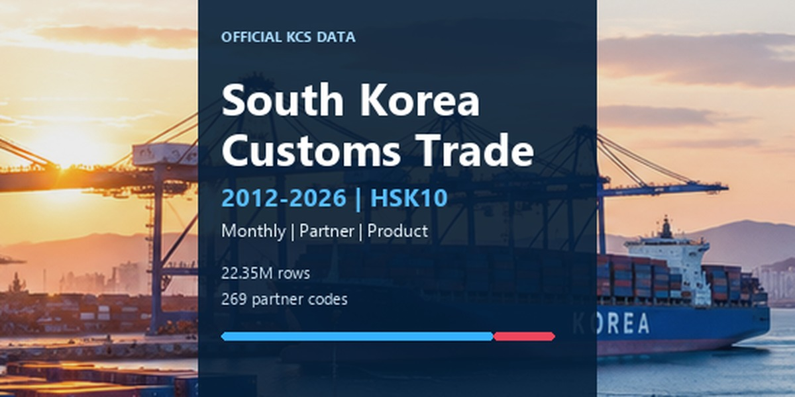

# 韩国海关贸易 2012–2026 — HSK 10 位商品级数据

[English](README.md) | [한국어](README.ko.md) | [日本語](README.ja.md) | [简体中文](README.zh-CN.md)



[数据模型 / 发布架构](DATA_MODEL.md)

本仓库基于韩国关税厅（Korea Customs Service）的官方公共数据，构建可复现的 Kaggle 数据产品。作为 Source of Truth 的基础粒度为：

`month × partner_country × HSK10`

最终数据集保留韩国 **10 位 HSK** 的完整明细，并在本地根据 HSK10 前缀派生 `hs8`、`hs6`、`hs4` 和 `hs2`，而不是分别采集这些聚合层级。

## 当前阶段

API pilot、国家代码 reference 验证、production collector、normalization pipeline、完整 historical backfill、官方年度 HSK reference 采集、release QA、private-first Kaggle 验证、Public Dataset 发布、Public starter Notebook 发布，以及 **Kaggle Usability 10.00** 均已完成。最初需要验证的核心采集假设是：

> 当提供 `cntyCd` 和时间范围、但省略 `hsSgn` 时，韩国关税厅按商品和国家查询的 API 是否会返回该国家完整的月度 HSK10 贸易记录？

第一次 live test 为 **US × 2025**。完整的 pilot matrix 为：

- 国家：`US`, `CN`, `JP`, `VN`, `DE`
- 年份：`2012`, `2017`, `2022`, `2025`

该 gate 通过后才开始 full crawl，目前 historical backfill 已全部完成。

### 路线图进度

当前阶段为 **12/12 — Public Kaggle release 已上线，Usability 10.00 已达成**。full historical backfill 完成了计划中的 4,035/4,035 个 country-year root，未解决失败数为 0，共采集 22,351,483 条 fact row。Stage 11 生成了 22,351,430 条 strict HSK10 记录，并保留 53 条 non-HSK10 source exception，canonical key 重复数为 0，最终 `release_gate_pass=true`。2012–2026 官方 CLIP 年度 HSK reference 共包含 178,911 条 annual HSK10 记录，韩文/英文品名覆盖完整，没有未解决的 duplicate-label review。

Kaggle Dataset `taeyangg4/south-korea-customs-trade-hsk10` 当前为 **Public**，Version 2 状态为 `Ready`，观测到的 Usability 为 **10.00/10**。Public starter Notebook `taeyangg4/south-korea-trade-in-5-minutes-hs6-quickstart` 已到 Version 3，并在 Kaggle runtime 中成功完成 Dataset mount 自动发现，无 traceback，也没有韩文字形警告。直接检查 Kaggle Usability 细项后，包含 file description 和 column description 在内的所有 score component 均为 `1`。

另外还有两个 Public 分析项目展示更深入的用法。`taeyangg4/korea-import-dependency-hsk10-supply-chain`（Version 2，`COMPLETE`）针对最近 12 个月 HSK10 进口计算 Top-1/Top-3 partner share、HHI 和 concentration-weighted import exposure。`taeyangg4/forecast-korea-imports-hs6-ml-vs-naive`（Version 3，`COMPLETE`）针对仅根据训练期选出的前 100 个 HS6 进口组，执行避免时间泄漏的机器学习 benchmark。在当前 2025-08 至 2026-07 holdout 上，采用 Huber loss 的 Gradient Boosting 将 WAPE 相比 **seasonal naive 改善 34.0%**，相比 **lag-1 persistence 改善 8.4%**，随后使用全部可用月份重新拟合并生成 2026-08 的 one-step-ahead forecast。这些 benchmark 数值对应当前 Dataset version，未来月度 refresh 后会自然变化。

最终产品目标是 **Kaggle Usability 10.00 + Dataset medal**。项目避免过度清洗官方源数据，而是重点保证可复现性、适合分析的粒度、文档完整性、可更新性，以及韩文文本的编码安全。

pilot matrix 还暴露了一个规模很小但重要的 upstream data-quality exception：在 1,379,734 条 fact row 中有 5 条不是 10 位 HSK，其中 4 条为 6 位、1 条为 9 位。对这些代码进行定向 API 复查后仍能复现，因此并非 parser error。这些记录保留在 raw XML 中，并隔离到 `non_hs10_rows.csv`；canonical HSK10 fact table 永远不会通过补零或猜测把它们变成 10 位代码。

官方 KCS lookup workbook 当前提供 **269 个唯一国家代码**。对全部 269 个代码执行 2025-01 live API 验证后，所有代码均被接受；其中 236 个当月有贸易记录，33 个没有交易。全代码 1 月 census 共得到 **128,207 条 fact row**，全部为数字型 HSK10。full-history 预计规模约为 **2,200万–3,500万行**，adaptive split 前的 production root-request 数为 **4,035**（269 codes × 15 calendar-year windows）。

最终 Stage-11 partitioned output 为：HSK10 **22,351,430 rows / 441,335,631 bytes**，HS8 **20,576,865 / 353,521,769**，HS6 **16,059,132 / 257,080,829**，HS4 **7,234,105 / 124,721,647**，HS2 **1,446,045 / 29,122,656**。五个层级均覆盖 2012-01 至 2026-07 的 175 个 monthly partition。

Stage 11 可通过以下命令复现：

```powershell
.\run_stage11.ps1
```

该流程要求完整 country-month coverage，关联 annual HSK revision，构建 HS8/HS6/HS4/HS2 residual-aware analyst table，并执行韩文文本/UTF-8 release gate。

用于 Kaggle 的 package 可通过以下命令构建：

```powershell
.\run_build_release.ps1
```

Git Bash 用户可运行 `bash ./run_build_release.sh`。release builder 会在 Git 忽略的 `release/kaggle/` 目录中生成每个 analytical grain 一个合并后的 Parquet、最新月份 HS6 CSV preview、reference/audit 文件、checksum、完整的 Kaggle file/column metadata、provenance 与文档。

国家代码 authority policy：

- `country_code` 与 `country_name_ko`：韩国关税厅 `관세청조회코드_v1.3.xlsx`
- English/M49/alpha3 enrichment：仅采用 UN Statistics Division M49 的 alpha-2 精确匹配
- 未匹配的 KCS code 保留，英文名/UN 字段留空，不删除也不猜测

## Revision-aware HSK reference

Stage 10 使用韩国关税厅 CLIP 的韩国关税表作为 historical HSK reference。该网站提供项目覆盖期间的年度韩国关税表版本，并返回包含韩文和英文商品名称的分层 tariff row。

本地 reference builder 按年份/章缓存 CLIP 原始 HTML，可从 cache 继续执行，只解析精确的数字型 HSK10 row，并写出年度和合并后的 Parquet reference data。

```powershell
python .\hsk_reference.py probe --year 2022 --chapter 01
.\run_hsk_reference.ps1
```

第一次 live probe 从 2022 年第 01 章解析出 69 条 HSK10 记录，韩文名和英文名均无缺失。2012–2026 全量采集也已完成：178,911 条 annual HSK10 记录，韩文名缺失 0，英文名缺失 0，annual key 重复 0，prefix mismatch 0。观察到 3 个相同代码的 source label variant；其中 2012 年的 2 个通过优先更具体且兼容的 wording 解决，2022 年的 1 个 revision-boundary conflict 则通过与 2021/2023 edition 自动比较解决。`HSK-YYYY` 表示 CLIP 官方 **年度版本**；项目不会从年度 selector 中推断其未提供的年内法定修订边界。

## Production collector

在任何大规模采集之前，先 dry-run 完整计划：

```powershell
python .\collector.py --dry-run backfill
```

截至 2026-09-08，该计划解析为 `201201–202607`、269 个国家代码、15 个 calendar-year window，以及 **4,035 个 root request**。当前 stable-month rule 是：只有在每月 15 日之后才使用上一个月，否则使用两个月前。

已完成的 full backfill 可通过以下命令复现：

```powershell
.\run_backfill.ps1
```

monthly revision refresh mode 会重新获取最新 stable month 以及之前 12 个月的数据：

```powershell
.\run_refresh.ps1
```

smoke test 可使用 `--countries`、`--max-roots` 和 `--dry-run`。production run manifest 写入 `data/audits/runs/`，其中不会包含 service key。

## 官方 API

- 韩国关税厅 按商品/国家进出口实绩（GW）
- Endpoint：`https://apis.data.go.kr/1220000/nitemtrade/getNitemtradeList`
- 主要参数：`serviceKey`, `strtYymm`, `endYymm`, `cntyCd`
- pilot 中有意省略 `hsSgn`

## Pilot 记录的内容

每次 request 都保留 raw response，并记录足够的 metadata 以支持 audit 和 resume：

- HTTP status 与 API result code/message
- 精确 response bytes 与 SHA-256
- gzip 压缩 raw XML
- item 数与 fact-row 数
- 观察到的 HS-code length distribution
- numeric 10-digit HSK compliance
- requested-month coverage
- duplicate `(month, country, hs10)` keys
- zero-trade rows
- negative amount/weight rows
- `trade_balance == export - import` reconciliation
- country-code mismatch
- 观察到的韩文 HSK-name variant
- elapsed time 与 retry count

data.go.kr service key 不会写入 manifest。

## Adaptive request splitting

逻辑采集单元为 `country × year`。可重试的 transport failure 会自动按以下方式拆分：

```text
country × year
  -> country × quarter
      -> country × month
```

authentication、parameter 和 API-level error 不会被 splitting 隐藏。

## API quota 策略

data.go.kr 官方页面当前列出的 development account 限额为 **每天 10,000 requests**。同一页面说明，在登记使用案例后，**operating account 可以申请提高 traffic**，而此 Korea Customs API 在 operating stage 需要审核。

本项目采用保守的 quota 管理原则：

- 请求成功时，优先每个 `country × calendar-year window` 只发 1 次 request。按照官方 reference，当前计划为 269 codes × 15 windows = **4,035 root requests**。
- 不预先把成功的 request 拆成 quarter/month；adaptive split 仅作为 oversized response 或 timeout 的 fallback。
- 如果 data.go.kr 返回 gateway reason code `22` (`LIMITED_NUMBER_OF_SERVICE_REQUESTS_EXCEEDS_ERROR`)，collector 会立即停止，而不是继续浪费 call。已成功的 manifest 可继续用于 resume。
- 如果 pilot 显示 adaptive split 可能使调用量超过每天 10,000 次，则在 production backfill 前申请 operating account / traffic increase。
- 不使用多个个人 account 或多个 key 来绕过 platform limit。

公开文件数据集 `관세청_월별_품목별_국가별 수출입실적` 可作为辅助官方 reference，但其公开说明覆盖的是 2021–2023 年 HS4，因此不能替代本项目的 HSK10 Source of Truth。

## Windows PowerShell 设置

```powershell
cd H:\dev\kaggle-data\korea-customs-trade
python -m venv .venv
.\.venv\Scripts\Activate.ps1
python -m pip install -r requirements.txt
$env:KCS_SERVICE_KEY='YOUR_DATA_GO_KR_SERVICE_KEY'
```

也可以在 project root 创建本地 `.env` 文件：

```text
KCS_SERVICE_KEY=YOUR_DATA_GO_KR_SERVICE_KEY
```

如果 process environment 中不存在该 key，collector 会自动加载 `.env`。`.env` 已被 Git 忽略。

运行第一次 pilot：

```powershell
.\run_us_2025.ps1
```

检查 pilot report 后再运行 matrix：

```powershell
.\run_matrix.ps1
```

## Linux / macOS 设置

```bash
python -m venv .venv
source .venv/bin/activate
python -m pip install -r requirements.txt
export KCS_SERVICE_KEY='YOUR_DATA_GO_KR_SERVICE_KEY'
./run_us_2025.sh
```

## 输出结构

```text
data/
  raw/
    year=2025/
      country=US/
        response_202501-202512.xml.gz
  normalized/
    hs10/
      year=2025/
        mm=01/
          part-00000.parquet
  derived/
    hs8/year=2025/mm=01/part-00000.parquet
    hs6/year=2025/mm=01/part-00000.parquet
    hs4/year=2025/mm=01/part-00000.parquet
    hs2/year=2025/mm=01/part-00000.parquet
  audits/
    manifests/
      year=2025/
        country=US/
          request_202501-202512.json
    coverage/
      pilot_results.json
      pilot_results.csv
      pilot_report.md
      hs_name_inventory.csv
      hs_name_changes.csv
    normalization/
      source_selection.csv
      normalization_manifest.json
      normalization_anomalies.csv
    derivation/
      derivation_manifest.json
```

raw data 与生成数据默认排除在 Git 之外。GitHub 用于备份代码、配置模板、文档以及可复现的 pipeline logic，不用于保存 service key 或大型 raw response。

## Tests

```powershell
pytest -q
```

## Pilot release gate

一个逻辑 country-year 只有在所有 effective leaf request 均成功、至少返回 1 条 fact row、所有 fact row 都具有数字型 10 位 HS code、所有 requested month 都存在，并且不存在 duplicate `(month, country, hs10)` key 时，才会被判定为 `PASS`。

pilot `PASS` 只验证所测试 request 中观察到的 API behavior，并不能证明 historical HSK-code completeness。Public release 仍需要使用独立官方 aggregate 和 revision-aware HSK codebook 进行 reconciliation。

## Canonical fact schema

```text
month
country_code
hs10
hs8
hs6
hs4
hs2
export_usd
export_weight_kg
import_usd
import_weight_kg
trade_balance_usd
hs_revision
```

`month` 以 `YYYYMM` 存储。`hs8`、`hs6`、`hs4` 和 `hs2` 都是 `hs10` 的 strict prefix。只有当代码存在于对应的官方年度 KCS CLIP edition 时才填充 `hs_revision`；未匹配的 trade fact 会继续保留，revision 为空并进入 audit，而不会被删除或猜测。

normalization 在 raw request 重叠时，会针对每个 `(country, month)` 独立选择最新的 successful manifest。这一点对 monthly revision refresh 很重要：如果旧 row 在更新后的 source 中消失，那么 rebuilt normalized dataset 中也会删除该 row，而不会残留为 stale append-only record。

长期 release architecture 记录在 [`DATA_MODEL.md`](DATA_MODEL.md) 中。面向分析者的 release 分别提供 HS2/HS4/HS6/HS8/HSK10 grain。canonical HSK10 始终只保留严格的数字型 10 位 source data；较短的 upstream code 被隔离，绝不会补零或猜测。residual-aware aggregation 只有在观察到的 prefix 能够无推断地确定 hierarchy level 时，才可将 exception 纳入对应层级。

## Dataset positioning

目标 Kaggle dataset：

**South Korea Customs Trade 2012–2026 — 10-Digit Product Level**

Positioning statement：

> South Korea's monthly customs trade at the full 10-digit HSK product level, across 200+ partner economies, with HS6/HS4/HS2 mappings and long-term history.
